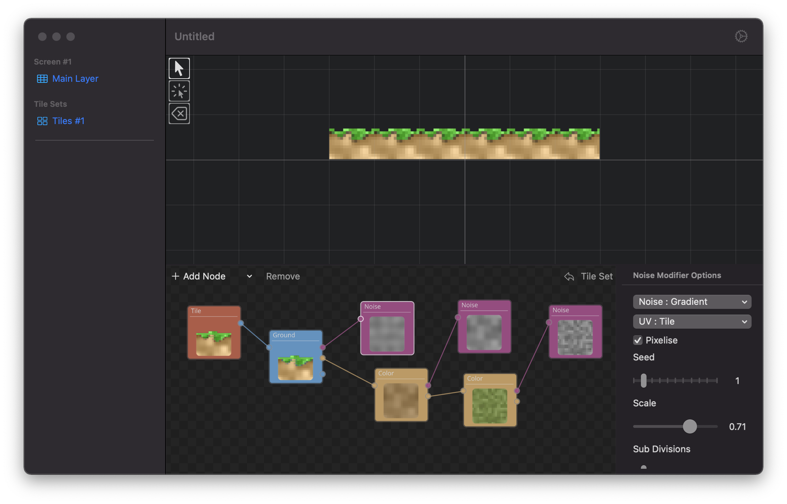

# Fabricated

## Create procedural 2D and 2.5D game assets on macOS and iOS/iPadOS

Fabricated is about creating procedural tile based game assets via an easy to use node system.

You will be able to create repeatable tiles which you can import into your favourite game engine or create whole levels inside Fabricated (which you can than also export).

Fabricated will support animation and also procedural Sprite (Character) generation in the future as well as 2.5D modes.

## Status

Fabricated is at the start of its development cycle and is currently in the concept stage

## How to help

A small donation to the author (via [PayPal](https://paypal.me/markusmoenig)) is appreciated. Should Fabricated become popular I may start a Patreon for it.
