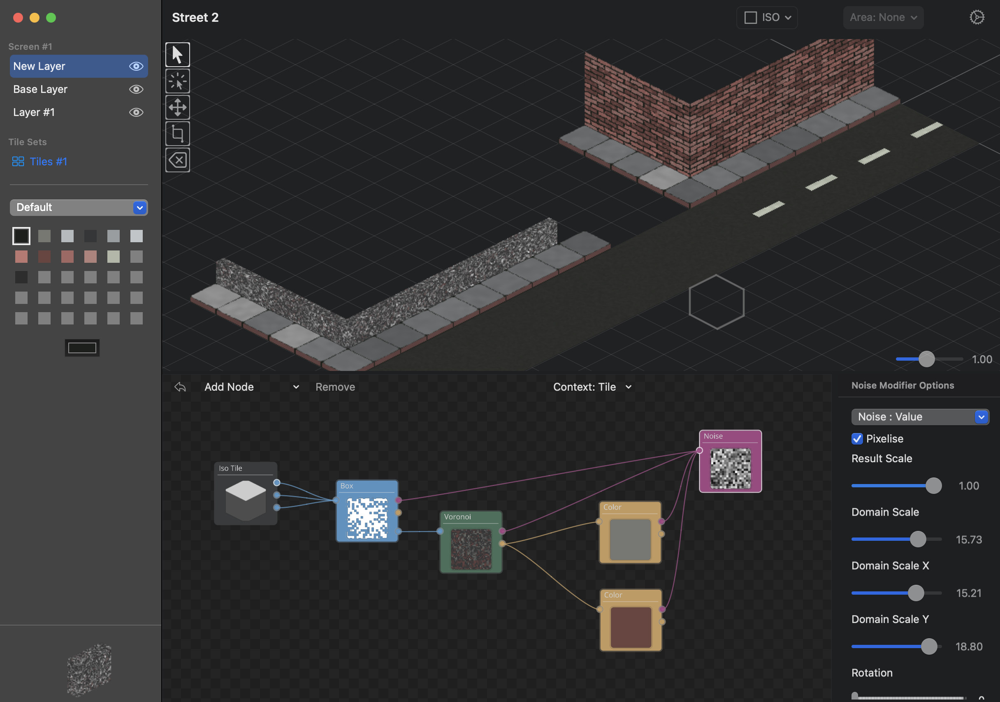

# Fabricated

## Create procedural 2D and 2.5D game assets on macOS and iOS

Fabricated can create tile based game assets via an easy to use procedural node system.

You are able to create repeatable tiles which you can import into your favourite game engine or create whole levels inside Fabricated (which you can than also export).

Tiles can be assembled into tile sets and you can globally change tile settings like the tile size, pixelization or anti-aliasing on the fly.

Create seamlessly repeating shaped tiles for every eventuality and decorate them with color and noise.

## Status

Fabricated is at the start of its development cycle and is currently in the concept stage.
